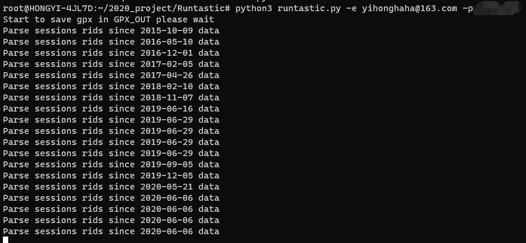
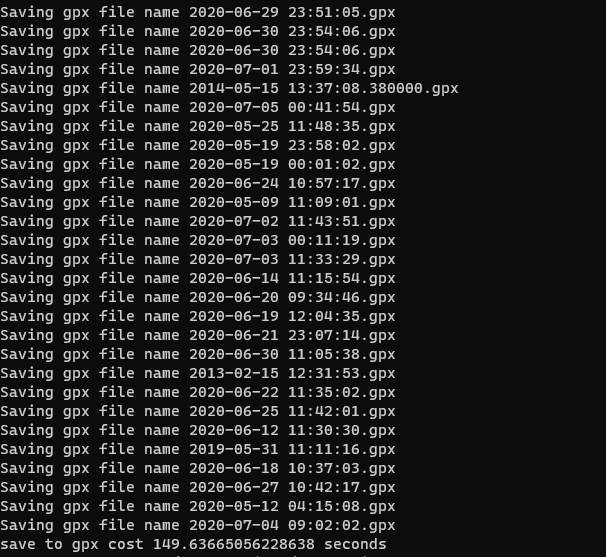

# Runtastic
Download all your Runtastic activities save to gpx

# Features

- All gpx: you can save your own data, which can upload to strava or runkeeper
- Easy to use: just command line
- Fast: Using async download 1500 activities only cost 3mins

# Using pip

1. pip install runtastic
2. runtastic  -e "your email" -p "your password"

# Use Clone

1. Clone this repo
2. pip/pip3 install -r requirements.txt (or use env)
3. python runtastic.py -e "your email" -p "your password"

# Acknowledgement

- Thanks to @Metalnem great [repo](https://github.com/Metalnem/runtastic)
